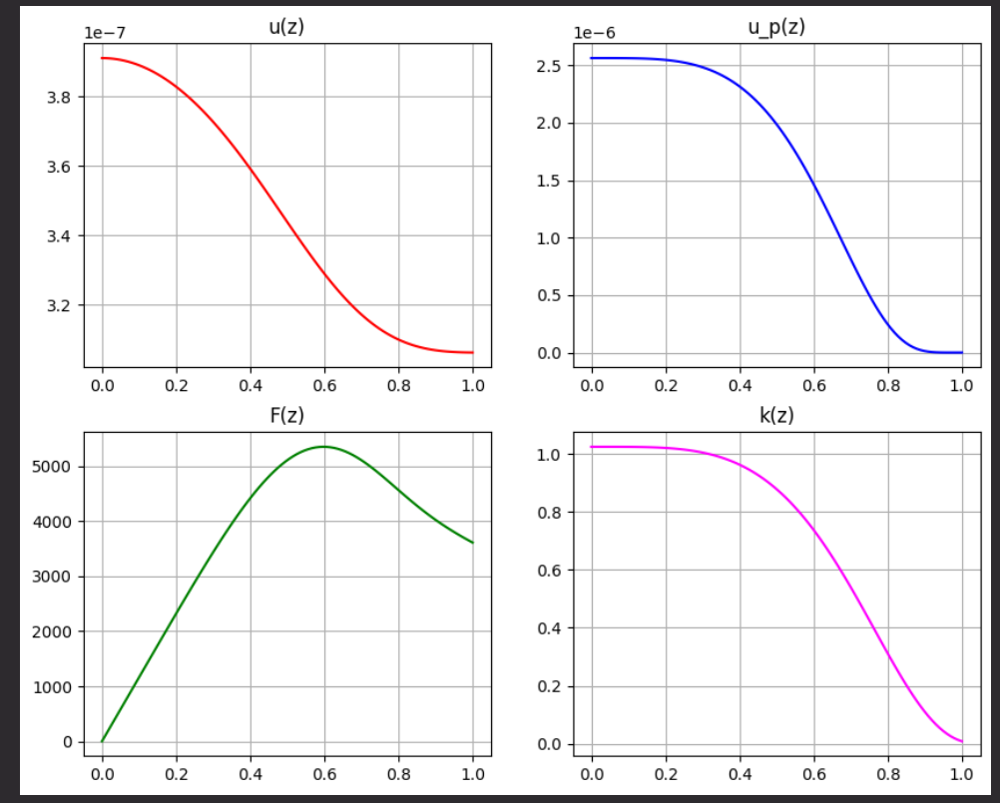
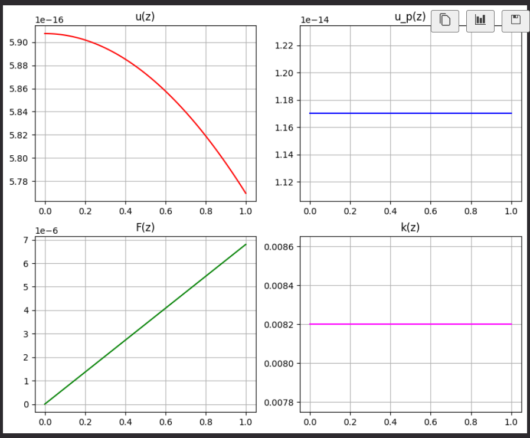
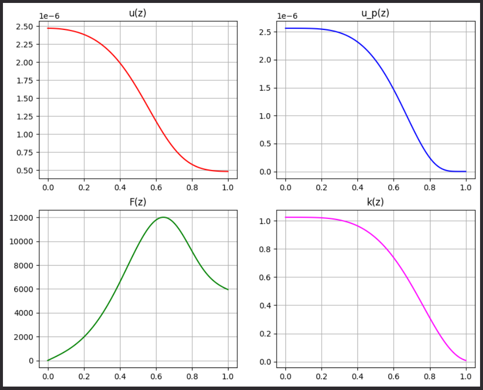
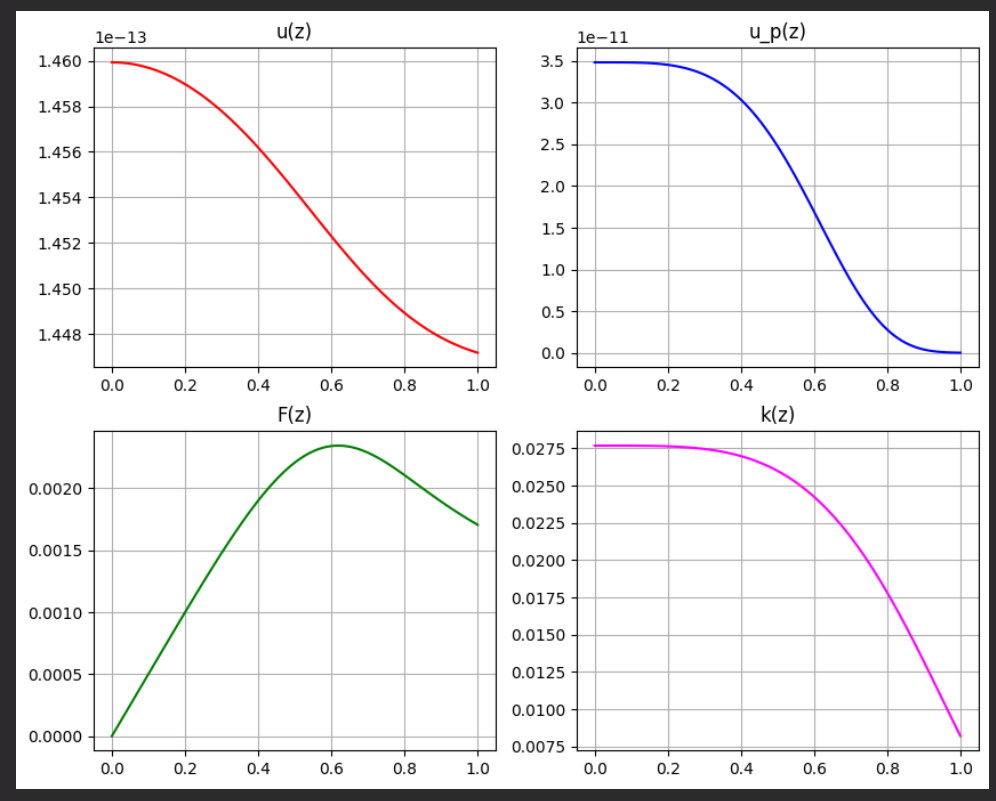

1. Влияние параметров задачи на выходные данные, т.е. зависимости: F(0), u(0) от T, p, R.

    1. Исходный график
    
    2. p = 0
    T(z) = T_w = const
    
    3. R = 5 - радиус цилиндр
    
    4. T0 = 3000 
    

2. Какие способы тестирования программы можете предложить?
   - Сравнение с физическими данными
   - Сравнеие с другими методами (неявный Эйлера, неявный трапеций)

3. Приведите классификацию методов решения систем ОДУ для задачи Коши.
   1. Явные (Эйлер (явный), Рунге-Кутт)
   2. Неявыне (Эйлер (неявный), трапеции)
   3. Одношаговые (Эйлер (явный), Рунге-Кутт)
   4. Многошаговые (Адамса)